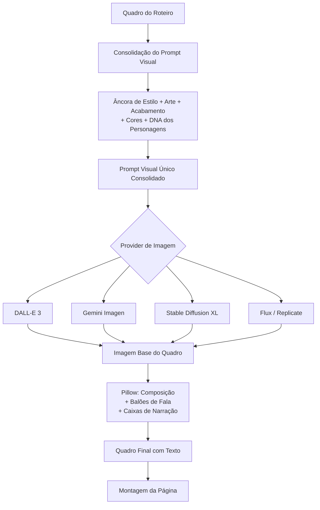

# PRD — LessonAI Comic Generator v3.0
### Aplicação Python + Streamlit para Geração de HQs Educativas

---

## 1. Visão Geral do Produto

**Nome do produto:** LessonAI Comic Generator  
**Stack:** Python 3.12+ · **uv** · **Agno** (framework agentic) · Streamlit  
**Idioma da UI:** Português (BR)  
**Objetivo:** Transformar qualquer tema em uma HQ completa, com roteiro gerado por agentes IA (Agno) + pesquisa na internet, imagens publicáveis em redes sociais e exportação em PDF.

---

## 2. Stack Tecnológica (Atualizada)

A aplicação utiliza as ferramentas mais modernas e eficientes para desenvolvimento Python:

| Camada | Tecnologia | Motivo |
|---|---|---|
| Gerenciador de Pacotes | **uv** | Velocidade extrema e gerenciamento robusto de dependências. |
| Orquestração de AGENTES | **Agno** (ex-Phidata) | Framework especializado em sistemas multi-agentes, memória e ferramentas. |
| Interface | Streamlit 1.35+ | Prototipagem rápida e dashboard interativo. |
| Geração de Texto | Multi-model (OpenAI, Gemini, Claude) | Flexibilidade total via interface única do Agno. |
| Geração de Imagem | Multi-provider (DALL-E 3, SD XL, Flux) | Parametrizável dinamicamente por página. |
| Composição Visual | Pillow (PIL) | Manipulação precisa de camadas, balões e fontes. |

---

## 3. Pipeline Editorial via Agentes Agno

O Agno gerencia a "Sala Editorial" como uma equipe de agentes especializados que colaboram:

1.  **Agente Editor-Chefe**: Coordenador geral, planeja os 6 atos da HQ.
2.  **Agente Roteirista**: Utiliza ferramentas de busca (DuckDuckGo/Tavily) para enriquecer o roteiro.
3.  **Agente Diretor Cinematográfico**: Define ângulos de câmera, luz e composição dos quadros.
4.  **Agente Artista/Visual**: Consolida as descrições em prompts visuais otimizados.
5.  **Agente de Continuidade**: Garante que o DNA dos personagens (Seção 7) seja mantido.
6.  **Agente Letrista**: Prepara os textos e SFX para a camada de composição final.

---

#### 16.2 Geração de Imagem (1 Requisição por Quadro)


────────────────────────────────────────────────────
[Q1] [Q2] [Q3] [Q4]
Status: ⏳ Gerando com DALL-E 3 (OpenAI)...
```

### 4.2 Provedores Suportados| Provider | Modelos |
|---|---|
| **OpenAI** | DALL-E 3 |
| **Google** | Gemini Image (Imagen 3) |
| **Stability AI** | Stable Diffusion XL, SD 3.5 |
| **Replicate** | Flux Pro, Flux Schnell, SDXL |
| **[Extensível]** | Novos providers via config |

---

## 5. Personagens — Sistema de CRUD (DNA Dinâmico)

O usuário pode gerenciar os personagens que os agentes do Agno devem "conhecer".

- **CRUD Completo**: Criar, editar, excluir personagens.
- **Injeção de Memória**: O Agno injeta o DNA visual no "Prompt de Conhecimento" toda vez que o agente de continuidade atua.

---

## 6. Estilos de HQ Parametrizáveis

| Estilo | Descrição |
|---|---|
| **Marvel / DC** | American superhero style, clean line art. |
| **Anime** | Japanese style, large eyes, vibrant. |
| **Ghibli** | Soft watercolor, detailed backgrounds, magical realism. |
| **Indie / Graphic Novel** | Artistic, organic lines, experimental. |
| **[+ Customizado]** | Usuário define o prompt base do estilo. |

### Bíblia Visual Editável
O usuário pode ajustar globalmente ou por estilo:
- Paleta de cores (cor base + acentos).
- Restrições (Negative Prompts).
- Regras de acabamento (Arte-final).

---

## 7. Temas — Gerenciamento (uv-ready)

O arquivo `references/tema.txt` serve como seed, mas agora o sistema permite CRUD completo de temas salvos em `config/themes.json`.

---

## 8. Estrutura de Arquivos (uv-based)

```
LessonAI/
├── pyproject.toml                 # Gerenciado via uv
├── .env                           # API keys (nao versionado)
├── .python-version                # uv fixed version 3.12.x
├── config/                        # JSONs de configuracao persistente
│   ├── styles.json
│   ├── characters.json
│   └── themes.json
├── src/
│   ├── agents/                    # Definicao de Agentes Agno
│   │   ├── editor.py
│   │   ├── writer.py
│   │   └── artist.py
│   ├── pipeline/
│   │   ├── image_generator.py     # Multi-provider parametrizavel
│   │   ├── composer.py            # Pillow composition
│   │   └── exporter.py            # PDF/ZIP
│   └── ui/                        # Interface Streamlit
│       ├── layout.py
│       └── views/
└── output/                        # Gerados (gitignored)
```

---

## 9. Fluxo de Publicação e Exportação

- **Exportação**: PDF A4/Digital, ZIP de imagens.
- **Social**: Publicação direta (via API) para LinkedIn e Facebook com legendas geradas.
- **Idioma**: Suporte a PT-BR, EN-US, ES, FR, DE, JP.

---

## 10. Configuração de APIs

Configuração **exclusiva via `.env`**:
- `OPENAI_API_KEY`
- `ANTHROPIC_API_KEY`
- `GOOGLE_API_KEY`
- `REPLICATE_API_TOKEN`
- `TAVILY_API_KEY`
- `LINKEDIN_ACCESS_TOKEN` / `FACEBOOK_ACCESS_TOKEN`

---

*PRD v3.0 — LessonAI Comic Generator · 11/03/2026*
